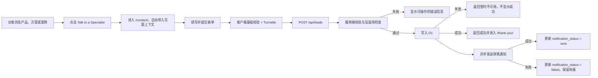
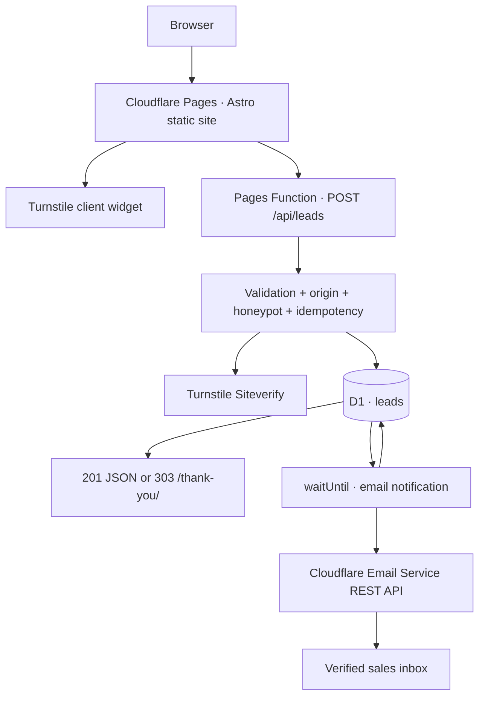

# TAICO EV 可靠询盘闭环（Lead Capture）PRD、开发计划与技术架构

> 状态：Draft for implementation
>
> 优先级：P0
>
> 适用项目：`taicoev.com` / `website/`
>
> 默认语言：English
>
> 最后更新：2026-07-22

## 1. 决策摘要

本项目需要把现有 CTA 从“跳转到邮箱或页面锚点”升级为一个可验证、可追踪、不会因邮件失败而丢失的询盘闭环。

MVP 采用现有 Cloudflare Pages 体系，不把 Astro 静态站改成服务端渲染，也不引入 CRM、管理后台或新的前端框架：

1. 新增统一联系页 `/contact/` 和可复用询盘表单。
2. 所有 CTA 跳转到联系页，并携带来源页面、产品或解决方案上下文。
3. 使用 Cloudflare Pages Function 提供 `POST /api/leads`。
4. 使用 Turnstile、蜜罐字段、请求大小限制和服务端校验拦截滥用。
5. 先把有效询盘写入 D1，再异步发送销售通知邮件。
6. 邮件失败不影响询盘保存；失败状态留在 D1 供人工恢复。
7. MVP 不建设后台，D1 仅作为防丢失和审计数据源，销售仍通过邮箱处理询盘。

这套方案的“可靠”指：**只有 D1 持久化成功后才向客户返回提交成功；通知邮件不是唯一数据副本。**

## 2. 背景与问题

当前网站已经具备产品页、解决方案页、案例页、Solution Finder 和多个联系 CTA，但缺少真正的询盘处理接口。

现状风险：

- 访问者需要自行打开邮件客户端，移动端和企业设备上容易中断。
- 无法稳定记录询盘来自哪个页面、产品、国家或营销渠道。
- 邮件发送失败时没有可恢复的数据副本。
- 无统一服务端校验、反垃圾提交和错误处理。
- 无法统计提交成功率、垃圾提交比例和销售响应时间。

## 3. 产品目标

### 3.1 用户目标

海外 B2B 访客能够在 2 分钟内提交采购或合作需求，并明确知道是否提交成功。

### 3.2 业务目标

- 把产品页、解决方案页和 Solution Finder 的访问转化为结构化销售线索。
- 保留页面和营销来源，便于判断哪些市场与内容产生有效询盘。
- 销售在正常情况下于 1 分钟内收到通知，并能直接回复访客。
- 即使通知邮件失败，运营人员仍能从 D1 找回询盘。

### 3.3 技术目标

- 有效询盘持久化成功率可观测。
- API 不在数据库写入失败时返回成功。
- 重复提交或网络重试不会创建重复询盘或重复通知。
- 不在应用日志中输出完整邮箱、电话、消息正文或 Turnstile token。
- 不保存原始 IP 地址。

## 4. 成功指标

上线后记录以下指标，前 30 天建立基线，不凭空设定商业转化率目标：

- 联系页访问量。
- CTA 到联系页的点击来源。
- 表单开始数与成功提交数。
- 服务端接受、校验失败、Turnstile 失败、数据库失败数量。
- 通知邮件成功与失败数量。
- 有效询盘数、有效率和主要来源国家。
- 销售首次响应时间。

技术验收目标：

- 任何被标记为“提交成功”的询盘都能在 D1 中查到。
- 相同 `submission_key` 重试只产生一条记录。
- 正常情况下销售通知在 60 秒内送出。
- 邮件通知失败时，记录保留且 `notification_status = 'failed'`。

## 5. 用户与角色

### 5.1 网站访客

典型用户包括经销商、道路救援企业、车队、商业物业、施工或弱电网场景采购人员。

核心诉求：

- 快速说明自己的场景。
- 知道 TAICO EV 是否能提供合适设备。
- 获得规格、配置、报价或合作回复。

### 5.2 销售人员

核心诉求：

- 收到结构化、可直接回复的询盘。
- 知道客户关注的产品、应用场景、国家和来源页面。
- 邮件通知异常时仍能找回线索。

### 5.3 网站运营人员

核心诉求：

- 查看提交与失败情况。
- 处理未发送通知。
- 调整接收邮箱、Turnstile 和数据保留策略。

## 6. MVP 范围

### 6.1 包含

- 独立联系页 `/contact/`。
- 提交成功页 `/thank-you/`。
- 可复用 `LeadForm` 组件。
- CTA 上下文传递与预填。
- Pages Function 表单接口。
- D1 持久化。
- Turnstile 客户端和服务端校验。
- 邮件通知。
- UTM、referrer、页面、产品、解决方案和语言记录。
- 明确的加载、校验、成功和失败状态。
- 基础运营查询与故障处理说明。

### 6.2 不包含

- CRM 双向同步。
- 销售管理后台、账号和权限系统。
- 附件上传。
- 在线聊天或 AI 客服。
- 自动报价。
- 按国家自动分配销售。
- 邮件营销订阅。
- 全站多语言。
- Cloudflare Queue 和自动重试 Worker。

`ponytail:` MVP 以 D1 作为询盘事实来源、邮件作为通知通道；当实际出现通知失败或销售团队扩张时，再增加 Queue、自动重试或 CRM，不为假设流量提前维护第二个服务。

## 7. 用户流程



## 8. 功能需求

### FR-01 联系入口统一

- Header、首页、产品详情、解决方案详情、案例详情和 Solution Finder 的联系 CTA 统一进入 `/contact/`。
- CTA 使用查询参数传递非敏感上下文，例如：
  - `/contact/?source=product-detail&product=m75`
  - `/contact/?source=solution-finder&solution=ev-roadside-assistance`
- 联系页显示上下文摘要，例如 “Interested in M75”。
- 查询参数只能用于预填和归因，服务端必须限制长度，不能视为可信数据。

### FR-02 表单字段

| 字段 | 必填 | 规则 | 用途 |
|---|---:|---|---|
| Name | 是 | 2–80 字符 | 联系人称呼 |
| Company | 是 | 2–120 字符 | B2B 资格判断 |
| Work email | 是 | 最长 254 字符，基础格式校验 | 主要回复渠道 |
| Country / Region | 是 | 2–80 字符 | 市场、标准和销售判断 |
| Application | 是 | 固定枚举 | 区分经销商、救援、车队等场景 |
| Phone / WhatsApp | 否 | 最长 50 字符 | 辅助联系渠道 |
| Purchase timeline | 否 | 固定枚举 | 判断采购阶段 |
| Requirements | 是 | 20–2000 字符 | 需求描述 |
| Privacy consent | 是 | 必须为 true | 数据处理确认 |
| Product / solution context | 否 | 隐藏或只读 | 来源上下文 |
| Website | 否 | 蜜罐字段，正常用户必须为空 | 拦截机器人 |

Application 初始枚举：

- EV dealership
- Roadside assistance
- Fleet charging
- Commercial property
- Construction / temporary site
- Distributor / partnership
- Other

Purchase timeline 初始枚举：

- Within 3 months
- 3–6 months
- More than 6 months
- Researching options

### FR-03 表单交互

- 使用原生 HTML 表单作为基础，JavaScript 只增强体验。
- 浏览器端即时提示必填、格式和长度错误。
- 服务端重复执行全部校验，不能依赖客户端结果。
- 提交期间禁用提交按钮并显示进行中状态。
- 成功后进入 `/thank-you/`，避免刷新导致重复提交。
- 错误提示与具体字段关联，并通过 `aria-live` 宣读全局结果。
- 保留用户已填写的非敏感字段，服务暂时失败时不要求重新填写。
- 提交按钮文案使用明确动作，例如 “Send inquiry”。

### FR-04 反垃圾与边界保护

- 表单嵌入 Cloudflare Turnstile。
- Pages Function 必须调用 Siteverify 完成服务端验证。
- 蜜罐字段非空时拒绝请求，但向机器人返回普通响应，不暴露检测规则。
- 只允许 `POST`，其他方法返回 `405`。
- 请求体上限 16KB。
- 校验允许的 `Content-Type`。
- 检查请求 `Origin` 是否属于生产或批准的预览域名。
- 对所有字符串 trim、规范化换行并限制长度。
- 邮件主题与头部字段必须移除 CR/LF，防止邮件头注入。
- 生产环境可在 Cloudflare 边缘增加 `/api/leads` 速率限制规则。

### FR-05 幂等与重复提交

- 客户端首次显示表单时生成 UUID `submission_key`。
- D1 对 `submission_key` 建立唯一索引。
- 同一 key 的网络重试返回已有提交结果，不插入第二条记录。
- 已发送通知的重复请求不再次发信。
- 如果已有记录的通知状态为 `failed`，允许触发一次受控重试，但仍不新建询盘。

### FR-06 可靠持久化

- 服务端完成 Turnstile 和字段校验后，先写入 D1。
- 只有数据库写入成功或确认是同一个幂等提交时，才向客户返回成功。
- 不把通知邮件当作询盘唯一副本。
- D1 写入失败返回 `503`，页面提示稍后重试并提供直接邮箱作为兜底渠道。
- D1 不保存 Turnstile token、原始 IP 或完整请求头。

### FR-07 销售通知

- D1 写入成功后，通过 `context.waitUntil()` 异步发送通知。
- 默认使用 Cloudflare Email Service REST API；API token 只存于 Cloudflare secret。
- 接收地址必须是已经验证、由项目负责人确认的销售邮箱。
- 通知主题格式：`[TAICO EV Lead] {country} · {application} · {company}`。
- 邮件正文包含：联系人、公司、国家、邮箱、电话、场景、时间、需求、产品/方案、来源页面、UTM 和提交时间。
- `Reply-To` 使用经过校验的访客邮箱；正文同时显示邮箱，避免邮件客户端行为差异。
- 发送结果更新到 D1：`pending`、`sent` 或 `failed`，同时记录尝试次数和最后错误类别。
- 不把第三方 API 的完整错误响应写入公开响应。

如果 Cloudflare 账户暂时无法使用 Email Service，只替换通知调用为现有邮件服务的 HTTP API；D1、接口和前端流程保持不变，不为单一替代服务建立抽象框架。

### FR-08 成功页与回复预期

- 成功页确认询盘已经收到。
- 默认承诺为 “We usually reply within one business day.”，上线前由销售负责人确认。
- 提供返回产品、解决方案和首页的链接。
- 不在 URL 或页面上暴露邮箱、电话、消息内容或数据库主键。
- 成功页作为最简单的提交转化统计页面。

### FR-09 来源归因

保存以下非敏感归因字段：

- `page_path`
- `source_component`
- `product_slug`
- `solution_slug`
- `locale`
- `referrer`
- `utm_source`
- `utm_medium`
- `utm_campaign`
- `utm_content`
- `utm_term`
- Cloudflare 推断的国家代码（与用户填写国家分开保存）

所有归因字段必须限制长度；不接受客户端提交的任意 JSON 对象。

### FR-10 隐私与数据保留

- 表单附近链接到 Privacy Policy。
- 同意文案说明信息用于回应商业询盘，不默认订阅营销邮件。
- MVP 默认保留 180 天；上线前由业务负责人根据实际合规要求确认。
- 删除请求由运营人员通过 D1 控制台执行并留存操作记录。
- Cloudflare 账号访问遵循最小权限，仅项目负责人可查看 D1 中的个人信息。
- 应用日志只记录 submission id、状态、耗时和错误类别，不记录表单正文。

### FR-11 运营恢复

MVP 不建设后台。运营人员至少需要保存以下只读查询：

```sql
SELECT id, created_at, company, country, email, notification_status
FROM leads
WHERE notification_status != 'sent'
ORDER BY created_at DESC;
```

- 发布后一周内每天检查未通知记录，稳定后调整为每周检查。
- 通知失败可由受控脚本或重复提交恢复，不直接修改用户内容。
- 如果 30 天内出现两次以上有效询盘通知失败，升级为 Queue + 自动重试消费者。

## 9. 非功能需求

### 9.1 可访问性

- 满足 WCAG 2.2 AA 的相关表单要求。
- 所有字段有可见 label，不能只依赖 placeholder。
- 错误信息可被键盘和屏幕阅读器访问。
- Turnstile 加载失败时显示可理解的兜底说明和直接邮箱。
- 颜色不是传达错误状态的唯一方式。

### 9.2 性能

- Turnstile 脚本只在联系页加载。
- 表单不引入 React、Vue 或新的客户端框架。
- 邮件通知异步执行，不阻塞成功响应。
- 正常 API 处理目标为 P95 小于 2 秒，不包含邮件最终投递时间。

### 9.3 安全

- 所有密钥仅保存在 Cloudflare secrets。
- 使用 D1 prepared statements，不拼接 SQL。
- 公开响应使用固定错误文案，不返回堆栈、SQL 或供应商内部信息。
- Preview 和 Production 使用不同 Turnstile 配置或明确限制 hostname。
- 表单接口纳入现有安全响应头和监控。

### 9.4 兼容性

- 支持当前主流 Chrome、Edge、Safari 和 Firefox。
- JavaScript 可用时提供内联反馈；JavaScript 不可用时仍能通过标准表单提交并收到服务端跳转结果。

## 10. 技术架构

### 10.1 架构图



### 10.2 选型理由

| 组件 | 选择 | 理由 |
|---|---|---|
| 页面 | Astro 静态页面 | 保持现有架构与部署方式 |
| 表单 UI | Astro + 原生 HTML | 无需新增前端框架，支持渐进增强 |
| 接口 | Cloudflare Pages Functions | 与当前 Pages 项目同域部署，无需 Astro adapter |
| 反垃圾 | Cloudflare Turnstile | 当前平台原生能力，支持服务端验证 |
| 数据副本 | Cloudflare D1 | 在返回成功前可靠保存，支持恢复和查询 |
| 通知 | Cloudflare Email Service REST API | 无需在浏览器暴露密钥，可限制发送身份和目标 |
| 测试 | Node 内置 `node:test` / `node:assert` | 不新增测试框架依赖 |

### 10.3 请求处理顺序

1. 检查方法、Origin、Content-Type 和 Content-Length。
2. 解析表单数据，拒绝未知的大型嵌套结构。
3. 检查蜜罐字段。
4. 规范化并验证所有字段。
5. 调用 Turnstile Siteverify。
6. 按 `submission_key` 查询或插入 D1。
7. 数据库成功后返回成功结果。
8. 使用 `waitUntil()` 发送通知并更新通知状态。

## 11. 数据模型

建议 D1 表：`leads`

| 字段 | 类型 | 说明 |
|---|---|---|
| `id` | TEXT PK | 服务端 UUID |
| `submission_key` | TEXT UNIQUE | 客户端幂等键 |
| `created_at` | TEXT | UTC ISO 时间 |
| `name` | TEXT | 联系人 |
| `company` | TEXT | 公司 |
| `email` | TEXT | 规范化邮箱 |
| `country` | TEXT | 用户填写国家/地区 |
| `cf_country` | TEXT NULL | Cloudflare 推断国家代码 |
| `phone` | TEXT NULL | 电话/WhatsApp |
| `application` | TEXT | 应用场景枚举 |
| `timeline` | TEXT NULL | 采购时间枚举 |
| `message` | TEXT | 需求正文 |
| `product_slug` | TEXT NULL | 产品上下文 |
| `solution_slug` | TEXT NULL | 解决方案上下文 |
| `page_path` | TEXT NULL | 来源路径 |
| `source_component` | TEXT NULL | CTA 来源组件 |
| `locale` | TEXT | 默认 `en` |
| `referrer` | TEXT NULL | 来源站点 |
| `utm_source` 等 | TEXT NULL | 营销归因 |
| `consent_at` | TEXT | 同意时间 |
| `notification_status` | TEXT | `pending` / `sent` / `failed` |
| `notification_attempts` | INTEGER | 通知尝试次数 |
| `notification_error` | TEXT NULL | 归一化错误类别，不存完整响应 |
| `notified_at` | TEXT NULL | 通知成功时间 |

索引：

- `UNIQUE(submission_key)`
- `INDEX(created_at)`
- `INDEX(notification_status, created_at)`

不在 MVP 中保存销售阶段或跟进记录；这些属于 CRM，而不是表单恢复存储。

## 12. API 契约

### 12.1 Endpoint

`POST /api/leads`

支持：

- 浏览器标准 `application/x-www-form-urlencoded` 或 `multipart/form-data` 表单。
- JavaScript 增强请求通过 `Accept: application/json` 获取 JSON 响应。
- MVP 不接受文件。

### 12.2 成功响应

JSON 模式：

```json
{
  "ok": true,
  "message": "Inquiry received."
}
```

非 JSON 模式：`303 See Other` 到 `/thank-you/`。

### 12.3 错误响应

| 状态 | 场景 | 客户端行为 |
|---:|---|---|
| 400 | 无法解析、蜜罐命中、请求格式错误 | 通用错误，不暴露检测规则 |
| 403 | Origin 或 Turnstile 不通过 | 提示刷新后重试 |
| 405 | 非 POST | 返回允许的方法 |
| 413 | 请求体过大 | 提示缩短需求内容 |
| 422 | 字段校验失败 | 返回字段级错误 |
| 503 | D1 或关键服务不可用 | 保留输入，显示邮箱兜底 |

错误 JSON 示例：

```json
{
  "ok": false,
  "code": "VALIDATION_ERROR",
  "fields": {
    "email": "Enter a valid business email."
  }
}
```

## 13. Cloudflare 配置

### 13.1 Binding

- `LEADS_DB`：D1 database binding。

### 13.2 Function secrets

- `TURNSTILE_SECRET_KEY`
- `EMAIL_API_TOKEN`

### 13.3 Build-time public variable

- `PUBLIC_TURNSTILE_SITE_KEY`

该值是公开 site key，但 Astro 静态构建时必须可用；它应配置在 Pages 构建环境或执行 `npm run build` 的 CI 环境中，不能只依赖 Pages Function 的运行时变量。

### 13.4 Function runtime variables

- `LEAD_NOTIFICATION_TO`
- `LEAD_NOTIFICATION_FROM`
- `ALLOWED_ORIGINS`
- `LEAD_RETENTION_DAYS=180`

接收邮箱和发送地址虽然不是密钥，也应由部署配置提供，避免在代码中散落业务地址。

## 14. 代码与文件计划

尽量保持最少文件：

### 新增

- `website/src/pages/contact.astro`
- `website/src/pages/thank-you.astro`
- `website/src/components/LeadForm.astro`
- `website/functions/api/leads.ts`
- `website/functions/lib/lead.ts`
- `website/migrations/0001_create_leads.sql`
- `website/tests/lead.test.ts`

### 修改

- `website/src/components/CtaBand.astro`：统一进入联系页并传递上下文。
- `website/src/components/Header.astro`：Contact 指向联系页。
- 产品、解决方案、案例和 Solution Finder 中的相关 CTA：传递产品/方案来源。
- `website/wrangler.jsonc`：增加 Pages 输出目录、D1 binding 和变量声明。
- `website/package.json`：增加最小测试和本地 Pages Function 验证脚本。
- `website/public/_headers`：如现有 CSP 生效，允许 Turnstile 所需来源。

`functions/lib/lead.ts` 仅承载可测试的字段规范化、校验和邮件内容生成；不建立 repository、service、factory 等单实现抽象。

## 15. 开发计划

### Phase 0：账户与业务确认（0.5 天）

产出：

- 确认销售接收邮箱和发件身份。
- 确认英文成功文案、隐私同意文案和回复时效。
- 创建 Turnstile widget。
- 创建 D1 数据库并确定 production / preview binding。
- 确认 Cloudflare Email Service 可用；否则确认已有邮件 HTTP API。

完成标准：外部账号、域名验证和配置责任人明确。

### Phase 1：前端表单与 CTA（1 天）

任务：

- 创建联系页、成功页和 `LeadForm`。
- 完成原生校验、可访问错误、提交状态和无 JS fallback。
- 接入 Turnstile，仅在联系页加载。
- 修改 CTA 并预填产品/方案上下文。
- 保存 UTM 与 referrer。

完成标准：本地页面在手机和桌面上可完整操作，键盘可提交。

### Phase 2：接口、校验与 D1（1 天）

任务：

- 建立 D1 migration。
- 实现 Pages Function。
- 实现服务端字段校验、Origin、大小、蜜罐和 Turnstile 校验。
- 实现 prepared statements 和幂等写入。
- 实现 JSON 与 303 两种响应。

完成标准：合法提交只写一条；非法或数据库失败不显示成功。

### Phase 3：邮件通知与运营恢复（0.5 天）

任务：

- 生成纯文本和 HTML 销售通知。
- 使用 `waitUntil()` 发送并更新状态。
- 配置已验证收件地址、发件域和 secret。
- 验证失败查询与人工恢复路径。

完成标准：邮件失败不丢数据，D1 可区分 pending/sent/failed。

### Phase 4：验证与发布（1 天）

任务：

- 运行单元、自检和生产构建。
- 使用本地 Pages + D1 验证完整流程。
- 在 Cloudflare Preview 环境运行正常、重复、错误和邮件失败用例。
- 检查日志无 PII。
- Production smoke test，确认销售实际收到邮件。
- 记录回滚和故障查询步骤。

完成标准：全部验收标准通过后上线。

预计开发量：约 4 个工作日，不含域名/邮箱验证等待和隐私文案审批。

## 16. 测试计划

### 16.1 最小自动检查

使用 Node 内置 `node:test` / `node:assert`，不新增测试框架。一个测试文件覆盖最容易回归的非平凡逻辑：

- 必填字段。
- 邮箱与长度边界。
- Application / timeline 枚举。
- 换行和空白规范化。
- 邮件头 CR/LF 清理。
- 未知字段不会进入持久化对象。
- 同一幂等键只产生一次写入意图。

### 16.2 集成场景

- 正常英文询盘。
- 产品页携带 product slug。
- Solution Finder 携带 solution slug。
- 无 JavaScript 标准提交。
- Turnstile token 缺失、过期、重复和无效。
- 蜜罐命中。
- 非法 Origin。
- 超长字段和超过 16KB 请求。
- 相同 submission key 连续提交。
- D1 写入失败。
- 邮件 API 失败。
- 邮件失败后重复请求触发受控重试。

### 16.3 人工验收

- iPhone/Android 尺寸下字段和按钮不溢出。
- 键盘能完成整张表单。
- 错误提示聚焦正确字段。
- 成功页不会显示个人信息。
- 销售邮件在桌面和移动邮箱可读。
- Reply-To 可直接回复客户。

## 17. 验收标准

- [ ] 所有主要联系 CTA 都进入 `/contact/`。
- [ ] 产品和方案来源被正确预填并写入 D1。
- [ ] 合法提交持久化后才显示成功。
- [ ] 无效字段不会写入 D1。
- [ ] Turnstile 在服务端验证。
- [ ] 同一 submission key 只有一条记录和一次成功通知。
- [ ] 邮件失败时询盘仍存在且状态为 failed。
- [ ] 数据库失败时用户看到可恢复错误和直接邮箱。
- [ ] 服务端日志不含完整 PII、token 或消息正文。
- [ ] 表单可通过键盘和屏幕阅读器使用。
- [ ] 无 JavaScript 时仍可提交。
- [ ] Production 收件邮箱完成真实 smoke test。
- [ ] 运营人员知道如何查询未通知询盘。
- [ ] Privacy Policy 和数据保留时间已确认。

## 18. 发布与回滚

### 发布顺序

1. 创建并迁移 D1。
2. 配置 preview bindings、Turnstile 测试 key 和邮件测试目标。
3. 部署 Preview，完成集成测试。
4. 配置 production secrets 和已验证收件地址。
5. 部署 Production。
6. 提交一条标记为测试的真实询盘。
7. 验证 D1、通知状态、邮件内容和成功页。
8. 删除测试记录或标记为测试数据。

### 回滚

- 前端故障：恢复 CTA 到现有 `mailto:` 兜底。
- Function 故障：保留联系页，显示直接邮箱并临时禁用提交按钮。
- 邮件故障：不回滚表单；D1 继续接收，运营人工查询并联系。
- D1 故障：表单不得返回成功，使用直接邮箱兜底。

回滚不得删除已经保存的 leads 表或生产询盘。

## 19. 风险与控制

| 风险 | 影响 | 控制 |
|---|---|---|
| 垃圾提交 | 污染销售邮箱和数据库 | Turnstile、蜜罐、长度限制、边缘限速 |
| 邮件 API 故障 | 销售未即时收到 | D1 先保存、状态记录、人工恢复 |
| 重复点击/网络重试 | 重复线索和通知 | submission key 唯一索引 |
| 密钥泄露 | 邮件或接口被滥用 | Cloudflare secrets、禁止客户端暴露 |
| PII 出现在日志 | 隐私风险 | 结构化状态日志，不记录正文 |
| 表单过长 | 转化率下降 | MVP 只保留必要资格字段 |
| 账户功能不可用 | 邮件集成延期 | 保留 Email Service 与现有邮件 API 二选一决策点 |

## 20. 后续升级触发条件

只有达到对应条件才升级：

- **Queue + 自动重试**：30 天内出现两次以上有效询盘通知失败。
- **CRM 集成**：销售人员超过 2 人，或每月有效询盘超过 30 条。
- **线索后台**：D1 人工查询每周发生两次以上。
- **国家自动分配**：形成明确区域销售负责人和 SLA。
- **多语言表单**：第一个区域语言页面进入开发。
- **附件上传**：真实客户持续需要发送现场图、单线图或招标文件。

## 21. 上线前待确认项

默认值已经给出，以下内容需要业务负责人在 Phase 0 确认：

- 销售接收邮箱。
- 发件地址与域名身份。
- 一工作日回复承诺。
- 隐私政策链接和同意文案。
- 180 天保留期限。
- Application 和 Purchase timeline 枚举。
- Cloudflare Email Service 或现有邮件服务。

## 22. 技术参考

- [Cloudflare Pages Functions](https://developers.cloudflare.com/pages/functions/get-started/)
- [Cloudflare Pages Functions bindings / D1](https://developers.cloudflare.com/pages/functions/bindings/)
- [Cloudflare Turnstile server-side validation](https://developers.cloudflare.com/turnstile/get-started/server-side-validation/)
- [Cloudflare Email Service](https://developers.cloudflare.com/email-service/)
- [Cloudflare Email Service sending](https://developers.cloudflare.com/email-service/get-started/send-emails/)
